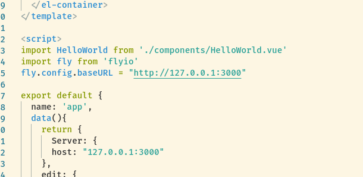

# MoToDo

# 使用方法

## 客户端

```bash
cd Client
yarn
yarn serve
```

## 服务端
```
cd Server
yarn
yarn build
yarn .
```

# 配置

## 客户端
客户端的主机配置在



这里的fly.config.baseURL是服务端的设置地址

## 服务端

导出的主类里面的initDateBase函数

```js
async initDateBase(){
        this.Fastify.log.info(`DirName ${__dirname}`);
        this.Fastify.log.info(`DirName ${resolve(__dirname, "Entity/*.js")}`);

        let DateBase = await createConnection({
            type: "sqlite",
            database: resolve(__dirname,"../database.sqlite"),
            entities: [
                resolve(__dirname, "Entity/*.js")
            ]
        })

        return DateBase;
    }
```

这里为了测试方便使用的是sqlite,同时也兼容mysql

只需要改成
```js
async initDateBase(){
        this.Fastify.log.info(`DirName ${__dirname}`);
        this.Fastify.log.info(`DirName ${resolve(__dirname, "Entity/*.js")}`);

        let DateBase = await createConnection({
            type: "mysql",
            "type": "mysql",
            "host": "localhost",
            "port": 3306,
            "username": "test",
            "password": "test",
            "database": "test",
            entities: [
                resolve(__dirname, "Entity/*.js")
            ]
        })

        return DateBase;
    }
```
